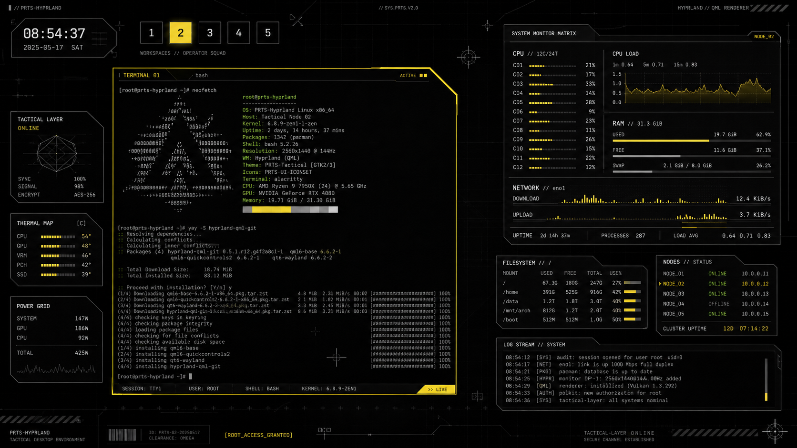

# Shell

A tactical desktop environment based on Hyprland and QML.

## Overview

This project aims to create a highly functional and visually striking tactical desktop environment. It features a high-contrast, techwear-inspired aesthetic with integrated system monitoring and a focus on power-user efficiency.

## Visual Progress

To help with development and visual debugging, here is the comparison between the target design and the current implementation.

### Target Design


### Current Progress


## Features

- **Techwear Aesthetic:** High-contrast tactical HUD styling with pure-black surfaces, sharp frames, scanlines, and a default gray tactical accent.
- **Runtime Appearance Controls:** Command-center settings for accent color, theme profile, scanlines, background mode, font scale, panel visibility, intensity, and polling interval.
- **Adaptive Edge Panels:** Left/right panels grow to fit content until they hit the top/bottom bars, then switch to internal scrolling.
- **Integrated Monitoring:** Live CPU, memory, swap, network, filesystem, power, battery, weather, environment/night-light, and service fallback telemetry.
- **Central Tactical Expansions:** Clickable orbital, CPU, network, filesystem, and log drill-downs deploy into the central safe area.
- **Graphical Orbital Sensor:** The left analog orbital clock opens a translucent sci-fi solar orbit view with time-based approximate planet positions, trails, reticles, and warning-yellow labels.
- **Command Center:** Unified central panel for system overview, settings, launcher/search, service status, service logs, tray drawer, clipboard history, calendar, notifications, keybinds, emoji, media, and power/session controls.
- **Launcher Providers:** Search installed desktop apps, built-in actions, calculator expressions via `=<expr>`, and shell commands via `$ <command>`.
- **Audio, Media, And Controls:** `wpctl` volume/microphone controls, local spectrum visualizer, MPRIS controls through `playerctl`, and local lyrics fallback.
- **Networking And Tray:** Network/VPN/Bluetooth telemetry, Wi-Fi scan/connect/rescan actions, active connection controls, and Quickshell system tray menu bridging.
- **Persistence:** Settings are normalized and persisted by the Zig helper `void-shell-settings`.
- **Hyprland & QML:** Built on Quickshell/QML for Hyprland with documented layer-shell/blur integration.
- **Modular Design:** Reusable primitives in `components/`, product surfaces in `modules/hud/`, and external integrations in `services/`.

## Usage

### Install Dependencies

Required:

- Quickshell v0.3.0 or newer
- Hyprland / Wayland session
- Qt/QML modules required by Quickshell
- Zig, for building the settings helper

Recommended runtime tools for full functionality:

- `hyprctl` for workspace, window, keyboard, and keybind telemetry
- `wpctl` for audio and microphone controls
- `playerctl` for MPRIS media controls
- `nmcli` for network, Wi-Fi, and VPN-like connection telemetry/actions
- `bluetoothctl` for Bluetooth power/status telemetry
- `wl-copy` and `wl-paste` for clipboard, emoji, calculator, and keybind template actions
- `curl` for weather telemetry
- `powerprofilesctl` for power profile controls
- `systemd-inhibit` for idle inhibitor control
- `gtk-launch` for desktop app launching
- `dbus-send` for notification server probing
- `swww` or `hyprpaper` for wallpaper application
- `magick` or `convert` for wallpaper color sampling
- `hyprsunset`, `gammastep`, or `redshift` for night-light/environment status detection

Missing optional tools should degrade to fallback status text instead of breaking the shell.

### Build Helper

Build the Zig settings helper from the repository root:

```bash
zig build
```

This creates:

```text
zig-out/bin/void-shell-settings
```

Quick smoke checks:

```bash
./zig-out/bin/void-shell-settings defaults
./zig-out/bin/void-shell-settings read
```

Settings are stored at:

```text
$XDG_CONFIG_HOME/void-shell/settings.json
```

If `XDG_CONFIG_HOME` is unset, the fallback path is:

```text
~/.config/void-shell/settings.json
```

### Run Shell

Run from the repository root:

```bash
quickshell -p .
```

The root QML file uses QApplication mode so tray platform/menu behavior can work with Quickshell:

```qml
//@ pragma UseQApplication
```

Keep this pragma at the top of `shell.qml`.

### Hyprland Setup

The HUD uses the `void-hud` layer-shell namespace. Optional blur rules:

```ini
layerrule = blur, void-hud
layerrule = ignorezero, void-hud
```

Blur is optional. The shell is designed to remain usable without compositor blur.

See [docs/hyprland.md](docs/hyprland.md) for details.

### Controls

Open the command center from the visible top-bar `SETTINGS` control or with `Ctrl+Alt+S`.

Common interactions:

- `Escape`: close the active central panel or command center
- Top workspace cells: switch Hyprland workspace
- Left analog orbital clock: open graphical orbital sensor
- Right CPU/network/filesystem/log sections: open central drill-down panels
- Tray left click: activate item
- Tray right click: secondary activate/menu fallback
- Command center launcher: type app/action names to search
- Launcher calculator: type `=<expression>`, for example `=1+2*3`, then click result to copy
- Launcher shell command: type `$ <command>`, then click to dispatch
- Emoji cells: copy emoji to clipboard
- Clipboard entries: restore/copy clipboard history item
- Power/session actions: click once to arm, click same action again to execute

### Settings

Open the command center and use the settings column to adjust:

- accent color, defaulting to gray `#8A8A8A`
- theme profile
- tactical background mode
- font scale
- scanline overlay
- live data polling
- microphone controls
- left/right panel visibility
- intensity
- polling interval
- wallpaper scan/apply/color sampling

Settings are persisted through `void-shell-settings`.

### Troubleshooting

Run the shell from a terminal to inspect logs:

```bash
quickshell -p .
```

Expected startup output includes:

```text
Configuration Loaded
```

Useful checks:

- If tray menu/platform errors appear, confirm `//@ pragma UseQApplication` is still the first line of `shell.qml`.
- If metrics show fallback values, check the optional tools listed above.
- If panels feel clipped, use mouse wheel inside side panels or command-center columns; dense panels scroll internally.
- If settings do not persist, run `zig build` and confirm `zig-out/bin/void-shell-settings` exists.
- If Hyprland workspace or window telemetry is missing, confirm the shell is running inside a Hyprland session.

## Documentation

Refer to [target.md](target.md) for a detailed breakdown of the interface elements.

See [docs/hyprland.md](docs/hyprland.md) for Hyprland layer-shell, blur, and workspace integration notes.

See [docs/settings.md](docs/settings.md) for the settings persistence contract and Zig helper plan.

## License

GPLv3
